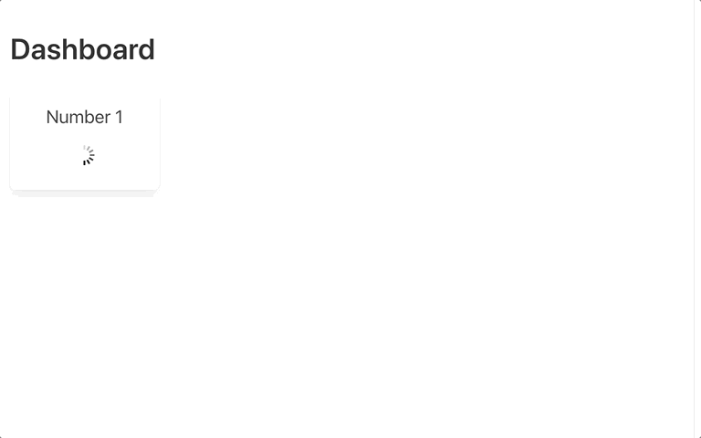

# Lazy Value

[](https://www.railsjazz.com)



Introducing a versatile value loader for your Ruby on Rails views, designed to optimize parallel loading of information on a page. This solution is perfect for scenarios where you need to display multiple stats, each taking 1-2 seconds to compute, thus causing a delay in page loading time.

Functioning similarly to lazy Turbo frames, this value loader has no reliance on Turbo and eliminates the need for creating new actions to load data. Make your page loading experience smoother and more efficient with this practical solution.

## Main Benefits

1. Just 1 line of code
2. No reliance on JavaScript dependencies, such as Turbo
3. Easy to implement with a "Plug & Play" approach
4. Compatible with Turbo Frames

## Essential Information & Constraints

1. Currently compatible with ERB only
2. Each lazy value should be atomic and not rely on any external value or variable initialized in the controller/view
3. Limit usage to one lazy_value_tag per line
4. Carefully follow the provided format when adding this block; refer to the README for guidance

## Usage

It's strongly suggested to configure initializer (can be generated with `rails g lazy_value initializer`). You can put your credentials/secrets/env variable. It's needed to use the same encryption key between deploys or server instances.

```ruby
LazyValue.setup do |config|
  config.salt = ENV["LAZY_VALUE_SALT"].presence || SecureRandom.random_bytes(ActiveSupport::MessageEncryptor.key_len)
  config.key = ENV["LAZY_VALUE_KEY"].presence || SecureRandom.hex(32)
end
```

And now you can use `lazy_value_tag` helper in your views:

```erb
<div class="column is-one-quarter">
    <div class="box has-text-centered">
        <h2 class="subtitle">Number 2</h2>
        <%= lazy_value_tag do %>
          <p class="title"><%= Project.pending.count %>%</p>
        <% end %>
    </div>
</div>
<div class="column is-one-quarter">
    <div class="box has-text-centered">
        <h2 class="subtitle">Number 3</h2>
        <p class="title">
          <%= lazy_value_tag { User.active.count } %>
        </p>
    </div>
</div>
```

It also works with partials:

```erb
<div class="box">
  <%= lazy_value_tag do %>
    <strong>Random 5 users</strong>
    <%= render "/home/users", users: User.limit(5).order("random()") %>
  <% end %>
</div>
```

And even compatible with Turbo.

```erb
<turbo-frame id="messages" target="_top">
  This content is from lazy loaded turbo frame.

  <%= lazy_value_tag do %>
    <h3 class="title"><%= rand(1000) %></h3>
  <% end %>

  <%= lazy_value_tag do %>
    <%= "I'm lazy loaded from the turbo frame" %>
  <% end %>
</turbo-frame>
```

## Installation

Add this line to your application's Gemfile:

```ruby
gem "lazy_value"
```

And then execute:
```bash
$ bundle
```

And that is it. Start using it.

## How it works

1. We call `lazy_value_tag` in the view
2. We save location from where it was called (with `caller_locations.first`), file + line number.
3. We encrypt this info using `ActiveSupport::MessageEncryptor`, creating span with spinner, and JS snippet that will call `/lazy_value/show?payload=`
4. In the controller we decrypt our data and reading ERB file and detecting our snippet
5. Depending on the block syntax we evaluate ERB or Ruby.
6. We return from the controller HTML that will replace snippen on the page.

## Testing

`bin/rails test:system`.

## TODO

- websockets options vs http
- pass variables
- change to modern JS?
- use POST? (if payload might be too big)

## Contributing

You are welcome to contribute.

[](https://opensource-heroes.com/r/railsjazz/lazy_value)

## License
The gem is available as open source under the terms of the [MIT License](https://opensource.org/licenses/MIT).


[](https://www.railsjazz.com/?utm_source=github&utm_medium=bottom&utm_campaign=lazy_value)
